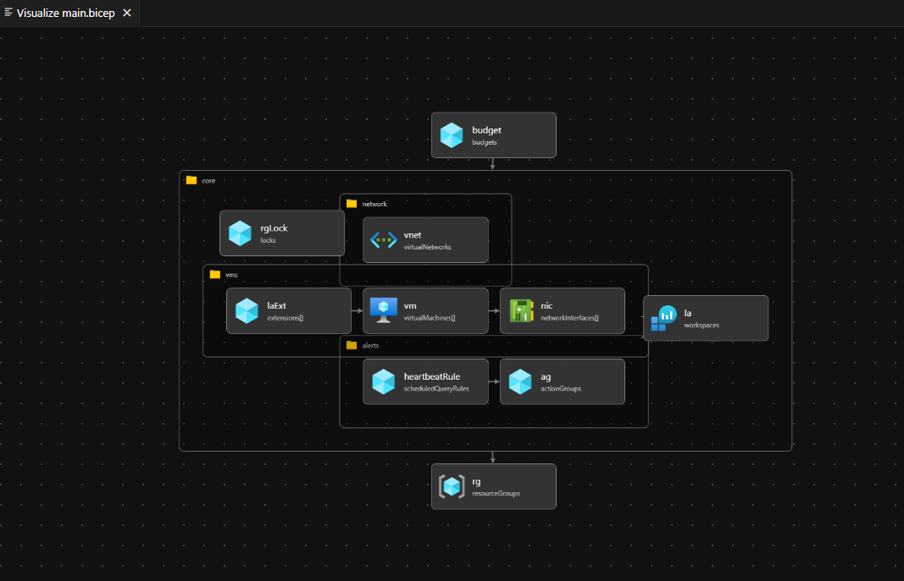
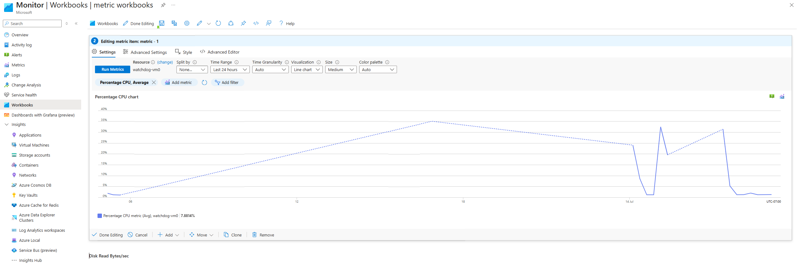

[](https://github.com/AbdullahMemon15/azure-watchdog/actions/workflows/azure-deploy.yml)

# Azure “Watchdog” – Cost & Health Lab

> Stand up a fully automated Azure environment with best-practice governance, monitoring, and cost controls—powered by Bicep + GitHub Actions.

---

## 📚 Table of Contents

1. [Overview](#overview)  
2. [Prerequisites](#prerequisites)  
3. [Quick Deploy](#quick-deploy)  
4. [What It Builds](#what-it-builds)  
5. [Architecture Diagram](#architecture-diagram)  
6. [Modules](#modules)  
7. [CI/CD](#cicd)  
8. [Workbook Preview](#workbook-preview)  
9. [Troubleshooting](#troubleshooting)  
10. [Contributing](#contributing)  
11. [License](#license)

---

## 🔍 Overview

This project demonstrates how to automate Azure resource provisioning, governance, monitoring, and cost management using:

- **Bicep** for concise, modular infra-as-code  
- **GitHub Actions** for CI/CD (validate & deploy on push)  
- **Azure Policies, RBAC, and Locks** to enforce best practices  
- **Monitor Workbook & Alerts** for real‑time VM health & budget tracking  

---

## 🚀 Prerequisites

- [Azure CLI](https://aka.ms/azure-cli) ≥ 2.50  
- Bicep CLI (bundled with Azure CLI)  
- A service principal or login with **Owner** rights on your subscription  
- `git` and a GitHub repo fork/clone  

---

## ⚡ Quick Deploy

```bash
# Subscription‑level deployment:
az deployment sub create \
  -l canadaeast \
  -f main.bicep \
  -p adminPassword="<YourP@ssw0rd!234>" \
     budgetAmount=20
```
Or, to target a specific RG:
```bash
az deployment group create \
  --resource-group watchdog-rg \
  -f main.bicep \
  -p adminPassword="<YourP@ssw0rd!234>" \
     budgetAmount=20
```
## 🏗 What It Builds

| Resource                     | Details                                                                   |
|------------------------------|---------------------------------------------------------------------------|
| **Resource Group**           | `watchdog-rg` with tags `env=dev`, `owner=<you>` and a **CanNotDelete** lock |
| **Virtual Network**          | `10.10.0.0/16`, Subnet `10.10.1.0/24`                                     |
| **2× B1s Windows VMs**       | Joined to Log Analytics, boot diagnostics enabled                         |
| **Log Analytics Workspace**  | 30‑day retention, linked to VM agents                                     |
| **Storage Account**          | Hot tier, RA-GRS                                                          |
| **Budget & Alert**           | Monthly budget, 80% email & Teams notifications                           |
| **Monitor Workbook**         | Custom charts: CPU %, Disk R/W, cost overview                             |

## 🖼 Architecture Diagram



*Figure: Bicep modules & resource relationships*

## 📦 Modules

- **core.bicep**  
  RG lock, Log Analytics, VM & network modules  
- **network.bicep**  
  Virtual Network + Subnet  
- **vms.bicep**  
  2× Windows VMs + Log Analytics extension  
- **alerts.bicep**  
  Action Group + Heartbeat alert rule  
- **workbook.bicep**  
  Parameterized Monitor Workbook template  

## 🔄 CI/CD

This repo uses **GitHub Actions** (`.github/workflows/azure-deploy.yml`):

```yaml
on:
  push:
    branches: [ main ]
  pull_request:
    branches: [ main ]

jobs:
  validate-and-deploy:
    runs-on: ubuntu-latest
    steps:
      - uses: actions/checkout@v3
      - uses: azure/setup-cli@v1
      - run: az bicep build --file main.bicep
      - uses: azure/login@v1
        with:
          creds: ${{ secrets.AZURE_CREDENTIALS }}
      - run: |
          az deployment sub create \
            -l ${{ inputs.location }} \
            -f main.bicep \
            -p adminPassword="${{ secrets.ADMIN_PASSWORD }}" \
               budgetAmount=${{ inputs.budgetAmount }}
```

## 📊 Workbook Preview



## 🧹 Cleanup / Teardown

> **WARNING:** These commands will **remove** _all_ resources in the `watchdog-rg` resource group, including locks.

```bash
# 1. Remove the read‑only lock so the RG can be deleted
az lock delete \
  --name rg-readonly \
  --resource-group watchdog-rg

# 2. Delete the entire resource group (and everything inside)
az group delete \
  --name watchdog-rg \
  --yes \
  --no-wait
```

## 🛠 Troubleshooting

- **Missing module path**  
  Ensure `modules/workbook/workbook.bicep` exists and is referenced exactly in `main.bicep`.
- **RBAC propagation delays**  
  Insert a short sleep (`sleep 60`) or split pipeline into stages so roles propagate before deploying budgets/workbooks.
- **Template validation**  
  Use `az deployment group what-if` to preview resource changes without applying them.

## 🤝 Contributing

1. Fork the repo  
2. Create a branch:
   ```bash
   git checkout -b feature/xyz
   ```
3. Commit your changes & push to your branch
4. Open a Pull Request against main
